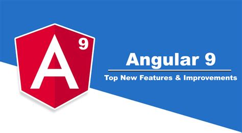
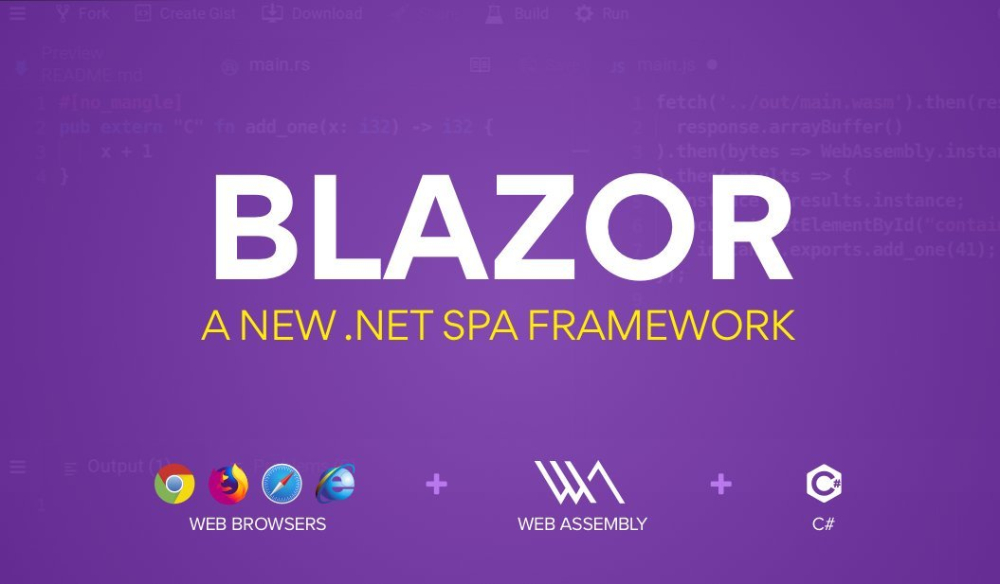
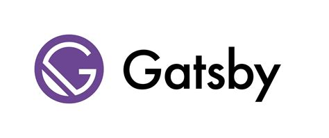
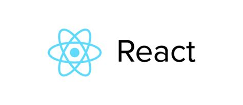
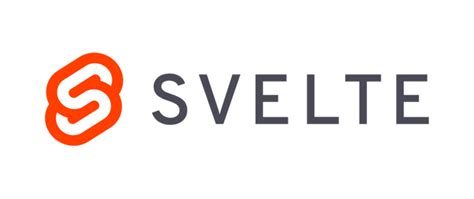
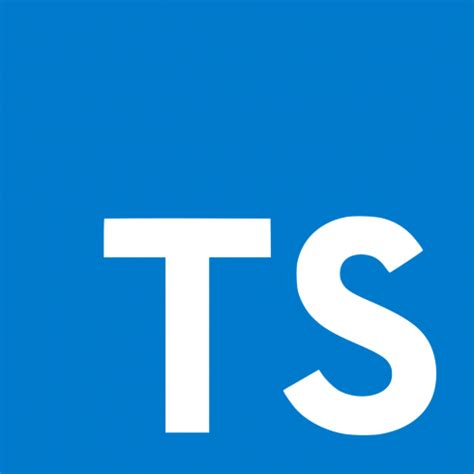
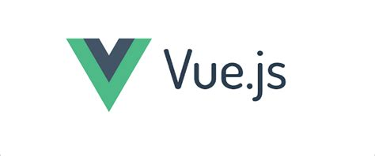
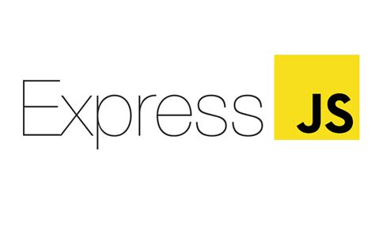

<!-- # Hrithik Tiwari - Working with Vision

Getting prepared for the ocean of opportunities waiting. -->

  

&nbsp;

### Current Roles

-   <b>Tech Lead at Swift Media Labs</b>: Since October 2020
    -   Increasing productivity through Agile Methodologies
    -   Flutter for cross platform handheld applications(We are with Flutter 2)
    -   React/Nextjs for Web Application Development
-   <b>React/Nextjs/Angular10/Vue/Nuxtjs/Svelte/Sapper development</b>

### Let's Talk tech
#### Have been doing ..
- React (State Management with Latest Hooks v17.3 June2021)
- MongoDB (Had most experience with Atlas, and one such with Node)
- Nodejs (Runtime)
- Express Server ( to Create REST APIs)

#### Learning

-   M

<!-- ### Individual Projects
- bbindustriesfamily.in
- heavenhillagroresort.com
- shalya-natural.vercel.app
- atulya-music.web.app
- swiftmedialabs.com
- amarathletics.com

 -->
<!-- ### Group Projects
- Web Based
    - medical.wekex.com
    - novioapp.com
- Flutter Android
    - Novio App <b>Salon Booking System</b> (https://play.google.com/store/apps/details?id=com.novioapp.users)
    - Novio Business<b>Store appointment Management and Accounts summary</b> (https://play.google.com/store/apps/details?id=com.novioapp.businesses) -->

<!--
### Work Experience
- <b>SM Online & SIAT(SM Institute of Advanced Learning)</b>( March 2018 to June 2018)
    - Network Administration
    - On-Site Wifi Installation & switches and Hub troubleshooting
    - Spicing and Slicing (Optical Fibre)
    - Crimping (LAN Cable)
- <b>Giri Tutorials, Boisar</b> (August 2018 to April 2019)
    - Teacher for classes 7 to 10
    - Maths, Science, Social Studies, English, Marathi, Hindi for 7 & 8 (state board)
    - English Grammar, Social Science and Maths for 8 & 9 (CBSE board)
    - Biology and Geometry for 9 & 10(state board)
- <b>Wekex.com Agency</b> (March 2020 to September 2020)
    - Junior Android Developer
    - Developed Novio App for Salon Appointment Booking
    - Worked on Medical Invoicing Web Application made with Angular 9/10
 -->

Skills
API Development

<!--### Skills
## `API Development`
API stands for Application Programming Interface. My API scope is limited to developing for Web, Mobile and Desktop Applications.

Web API Development

Web API Development

Web API Development

 

 

 

 

 

 </detail>

 
 

 

 
App Development

 

 

 

 

 

         

## Backend

 -->

<!--
### Education
- Chinmaya Vidyalaya, Tarapur (Jr. KG to 12th):
  - Chinmaya Vidyalaya is a SWAD(School With A Difference) where I completed my foundational and higher secondary studies.
  - Passed out 10th with distinction (9.8 CGPA)
  - Passed out 12th PCM ith Fairly good marks
- Bachelors From Mumbai University in Information Technology (B.Sc.IT)
    - June 2018 to May 2021
 
### School Achievements
- Two Times Rank Holder in Science Talent Search Examination (STSE held as Interschool Science Quiz)
- 2nd Prize for Learning 118 Elements of Periodic Table Competition.
- 1st Prize in Slow Cycling Race in 2018 Chinmaya Sports Events

-->

<!--
<h3 align="left">Connect with me:</h3>

<h3 align="left">Languages and Tools:</h3>

                    

-->

## Some of my tech guides

-   <a href="https://github.com/wekex35">Nirmal Bro</a>: I am very inspired by the awesome working spirit of Nirmal Bro, He encouraged me towards learning Nodejs backend in flutter and also taught me many awesome tips and tricks in coding, he just changed my perspective in coding during my internship at wekex. He wakes with Pc and sleeps again with PC. He is so passionate and dedicated that we can't think about it much. He is also the founder and CEO of Wekex(Wekend Expo) Company
-   <a href="https://github.com/piyush2greedy">Piyush Bro</a>: I met Piyush through Nirmal Bro, and now at the moment, it was a wholesome new experience to enter into this field. The tech experience of Piyush is at next level, the second most important thing is his energy level. He is just too energetic and sleeps at most just 4hrs a day..

